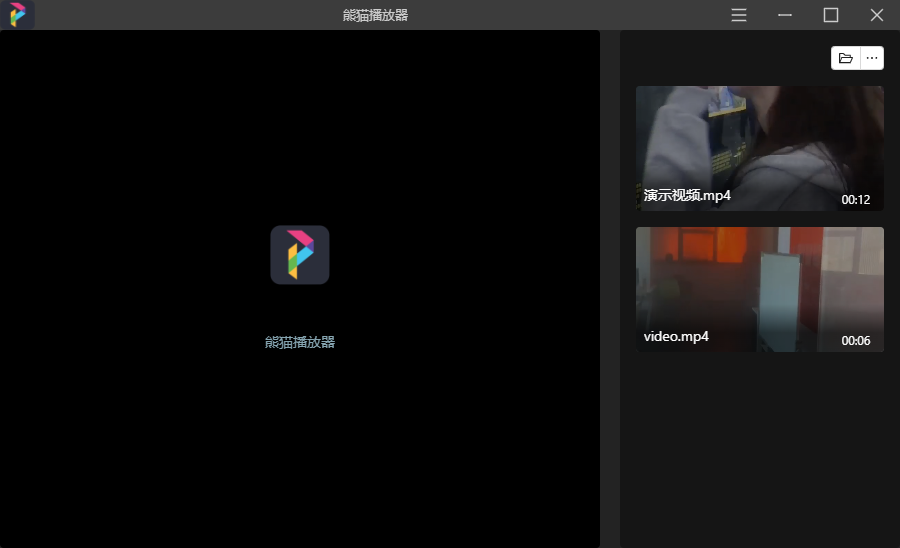

# panda-player 熊貓播放器

> Electron + React + Ant Design

## 运行

### Install

```bash
$ yarn
```

### Development

```bash
$ yarn dev
```

### Build

```bash
# For windows
$ yarn build:win

# For macOS
$ yarn build:mac

# For Linux
$ yarn build:linux
```

## 界面UI


